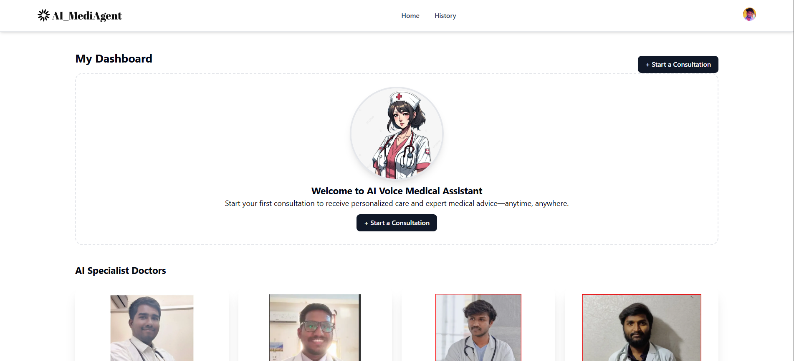

# 🩺 AI Voice Medical Assistant — Real-Time AI-Powered Healthcare Bot

A full-stack AI SaaS application that allows users to interact with a virtual doctor using real-time voice input. The assistant listens to user symptoms via voice, processes them using powerful AI models, and responds with intelligent, medically-informed answers — all in real time.

---

## 🎥 Demo Video

> Click the thumbnail to watch the real-time AI voice medical assistant in action.

---

## 🧰 Tech Stack

| Layer            | Tools Used                                           |
|------------------|------------------------------------------------------|
| Frontend         | React.js, Tailwind CSS                               |
| Backend          | Next.js (App Router), TypeScript                     |
| Voice Interface  | Vapi AI, AssemblyAI                                  |
| AI Model         | Google Gemini (LLM for understanding and response)   |
| Authentication   | Clerk                                                |
| Database         | Neon DB (PostgreSQL)                                 |
| Deployment       | Vercel                                               |

---

## 🧠 Features

- 🎙️ **Real-Time Speech Recognition**  
  Converts live voice input to text using AssemblyAI and Vapi AI.

- 🧠 **AI-Powered Medical Understanding**  
  Google Gemini interprets symptoms and responds like a virtual doctor.

- 🔐 **Secure Authentication**  
  Clerk ensures secure user sign-in, session handling, and access control.

- ☁️ **Cloud-Backed Storage**  
  Stores user interaction history and medical context in Neon DB.

- 📱 **Responsive UI**  
  Designed with Tailwind CSS for mobile and desktop compatibility.

- ⚡ **Instant Deployment**  
  Serverless deployment on Vercel for speed, scalability, and CI/CD.

---

